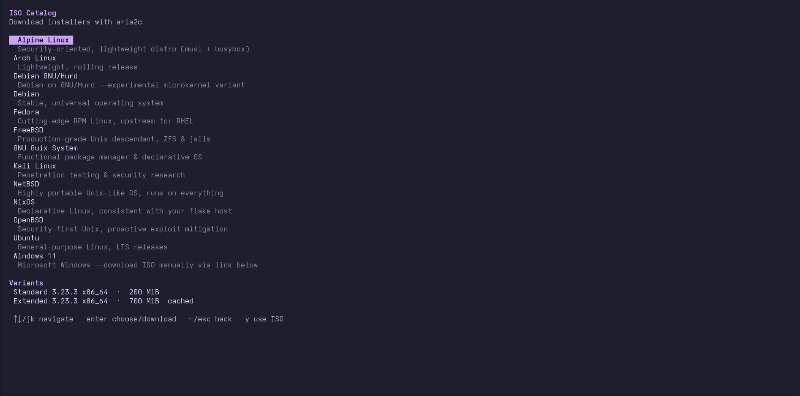

# vmTUI

A terminal UI for managing local QEMU virtual machines. Create, launch, stop, edit, and delete VMs with an interactive keyboard-driven interface.



Shown below is the built-in ISO catalog screen with distro variants and cached image detection.

## Features

- Interactive TUI built with [Bubble Tea](https://github.com/charmbracelet/bubbletea)
- Manage QEMU virtual machines with keyboard shortcuts
- Download OS installer ISOs from a built-in catalog
- Boot installer ISOs directly into VMs
- View VM logs and manage disk assets
- Customizable color themes via `tui/colors.json`

## Requirements

### Without Nix

The following must be installed on your system:

- **Go** (1.24+) — to build and run the application
- **QEMU** (`qemu-system-x86_64`) — to run virtual machines
- **aria2** — to download ISO images from the catalog

On Debian/Ubuntu:

```bash
sudo apt install golang-go qemu-system-x86 aria2
```

On Arch Linux:

```bash
sudo pacman -S go qemu-full aria2
```

On Fedora:

```bash
sudo dnf install golang qemu-system-x86 aria2
```

### With Nix

- [Nix](https://nixos.org/download/) with flakes enabled

## Installation

### Using Nix (recommended)

**Run directly from the flake:**

```bash
nix run github:yoptabyte/vmTUI
```

**Or clone and run:**

```bash
git clone https://github.com/yoptabyte/vmTUI.git
cd vmTUI
nix run .
```

**Add to your Nix profile:**

```bash
nix profile install github:yoptabyte/vmTUI
```

Then run `vmctl` from anywhere:

```bash
vmctl
```

**Enter the development shell:**

```bash
nix develop
go run .
```

### Without Nix

Clone the repository and run with Go:

```bash
git clone https://github.com/yoptabyte/vmTUI.git
cd vmTUI
go run .
```

Or build a standalone binary:

```bash
go build -o vmctl .
./vmctl
```

## Usage

Once the TUI is running, use these keyboard shortcuts:

| Key       | Action                |
|-----------|-----------------------|
| `↑↓`/`jk` | Navigate VM list      |
| `enter`   | Launch selected VM    |
| `s`       | Stop running VM       |
| `i`       | Boot installer ISO    |
| `d`       | Download ISO catalog  |
| `a`       | Manage assets         |
| `n`       | Create new VM         |
| `e`       | Edit selected VM      |
| `l`       | View VM log           |
| `x`       | Delete selected VM    |
| `q`       | Quit                  |

## Configuration

### Colors

Edit `tui/colors.json` to customize the color theme. The file uses a simple JSON format:

```json
{
  "bg":         "#11111B",
  "panel":      "#1E1E2E",
  "border":     "#313244",
  "accent":     "#CBA6F7",
  "text":       "#CDD6F4",
  "subtext":    "#A6ADC8",
  "muted":      "#7F849C",
  "success":    "#A6E3A1",
  "danger":     "#F38BA8",
  "warning":    "#F9E2AF"
}
```

After changing colors, rebuild the application.

## License

MIT — see [LICENSE](./LICENSE) for details.
